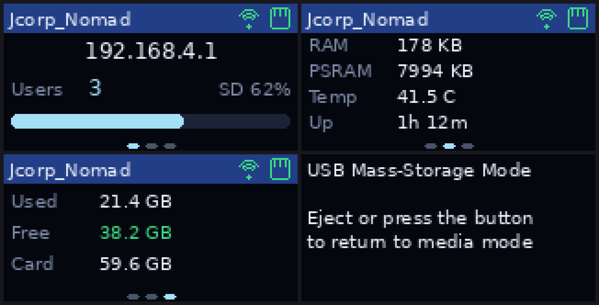

# Jcorp Nomad on the Pocket-Dongle-S3 (0.96")

This is the build guide for running Nomad on the USB-stick style ESP32-S3
boards — the **GNPE Pocket-Dongle-S3-0.96**, the **LilyGO T-Dongle-S3** and the
various clones of that design. They all share the same recipe: an ESP32-S3
N16R8 module, a 0.96" ST7735 IPS panel at 160x80, a microSD slot hidden inside
the USB-A shell, an APA102 status LED and a boot button.

Nomad still builds for the original Waveshare ESP32-S3-LCD-1.47 board — see
[Switching boards](#switching-boards).

---

## 1. Before you flash: run the self-test

These dongles are made by several factories and the pin maps are *usually*
identical to LilyGO's reference design, but not guaranteed. Flash
`firmware/NomadHardwareTest` first — it is a single self-contained sketch that
reuses the same `board_config.h` the firmware does.

It checks, and tells you exactly what to change if something is off:

| Step | Verifies | Fix if wrong |
| --- | --- | --- |
| Chip report | 16 MB flash + 8 MB OPI PSRAM detected | Board menu settings (below) |
| Backlight ramp | `LCD_BL_ACTIVE_LEVEL` polarity | Flip it in `board_config.h` |
| Colour bars | Controller, colour order, inversion | `LCD_MADCTL` BGR bit `0x08`, `LCD_INVERT_COLORS` |
| Edge frame | Window offsets | `LCD_OFFSET_X` / `LCD_OFFSET_Y` |
| LED sweep | LED type and channel order | `NOMAD_LED_TYPE`, `led_write()` in `RGB_lamp.cpp` |
| SD sweep | SD pin map — **tries known alternatives automatically** | Copy the pins it reports into `board_config.h` |
| Button | `BOOT_BUTTON_PIN` | Change it in `board_config.h` |

Everything the port needs to know about your board lives in one file:
`firmware/JcorpNomadProject/board_config.h`.

---

## 2. Building and flashing

`tools/nomad-setup` does everything in this section for you, including picking
the partition scheme from the flash size it reads off the chip:

```
sudo ./tools/nomad-setup --install-deps
```

See [tools/README.md](../tools/README.md). If you would rather drive the
Arduino IDE by hand, these are the settings it uses.

Install **esp32 by Espressif Systems, version 3.x** (the firmware uses the 3.x
`ledcAttach()` API). Then, under *Tools*:

| Setting | Value |
| --- | --- |
| Board | ESP32S3 Dev Module |
| USB CDC On Boot | Enabled |
| CPU Frequency | 240 MHz |
| Core Debug Level | None |
| USB DFU On Boot | Disabled |
| Erase All Flash Before Sketch Upload | Disabled |
| Events Run On | Core 1 |
| Flash Mode | QIO 80 MHz |
| Flash Size | **16MB (128Mb)** |
| JTAG Adapter | Disabled |
| Arduino Runs On | Core 1 |
| USB Firmware MSC On Boot | Disabled |
| Partition Scheme | **16M Flash (3MB APP/9.9MB FATFS)** |
| PSRAM | **OPI PSRAM** |
| Upload Mode | UART0 / Hardware CDC |
| Upload Speed | 921600 |
| USB Mode | Hardware CDC and JTAG |

> **PSRAM must be OPI**, not QSPI. The N16R8 module has octal PSRAM, and
> selecting the wrong mode either fails to detect it or hangs at boot. Octal
> PSRAM also permanently occupies GPIO 33–37, which is why nothing in the pin
> map uses those.

Required libraries — **exact versions**, as pinned upstream. ArduinoJson in
particular must be 7.x; the firmware uses the v7 `JsonDocument` API, which is
not source compatible with v6.

| Library | Version |
| --- | --- |
| `LVGL` by kisvegabor | 8.3.10 |
| `ArduinoJson` by Benoit Blanchon | 7.3.0 |
| `Async TCP` by ESP32Async | 3.4.7 |
| `ESP Async WebServer` by ESP32Async | 3.7.1 |
| `SdFat` by Bill Greiman | 2.3.0 |

Copy `firmware/JcorpNomadProject/lv_conf.h` next to the `lvgl` library folder,
or let `tools/nomad-setup` do it.

### Getting into the bootloader

The stick has no reset button. To force download mode: hold the boot button
while plugging it in. From a running Nomad you can also POST to `/flash-mode`
from the admin page.

---

## 3. Pin map

From the schematic GNPE supply on request. **This board is not a LilyGO clone** —
it shares the form factor and the panel, but the wiring is entirely different.
If you have an actual LilyGO T-Dongle-S3, use `NOMAD_BOARD_TDONGLE_S3` instead;
its map is in the same file.

### Display — ST7735, 160x80 landscape

| Signal | GPIO |
| --- | --- |
| MOSI / SDA | 11 |
| SCLK | 10 |
| CS | 12 |
| DC | 13 |
| RST | 14 |
| Backlight | not in the schematic — presumed tied on |

`LCD_PIN_BL` is `-1`, meaning no software control: the panel is simply lit and
the admin brightness slider is a no-op. If your schematic does show a backlight
GPIO, set it there and brightness starts working.

The 160x80 panel sits inside the ST7735's 132x162 GRAM, so the window is offset
by `X=1, Y=26` with `MADCTL = 0xA8` (MY | MV | BGR) and inversion on. If the
image comes out upside down, that is what the **flip screen** option in the
admin page is for.

### microSD — plain SPI, separate bus

**This card is not on an SDMMC bus.** It is a four-wire SPI device on its own
SPI host, so there is no CMD line and no DAT1/DAT2/DAT3 — `SD_MMC` cannot drive
it at all. The firmware selects the `SD` (SPI) filesystem for this board via
`NOMAD_SD_BUS` in `board_config.h`; see `nomad_sd.h`.

| Signal | GPIO |
| --- | --- |
| SCLK | 17 |
| MOSI | 18 |
| MISO | 16 |
| CS | 47 |

The card sits on `HSPI` while the display uses `FSPI`, so the two never
contend. `NomadSD_Mount` starts at 20 MHz and steps down through 10, 4 and
1 MHz until the card answers, and **never** formats on a failed mount.

An earlier revision of this port assumed a 4-bit SDMMC bus with DAT lines on
GPIO 15 and 48. That was wrong: neither pin is connected to the card.

### Status LED

None in the pin list GNPE provided, so `NOMAD_LED_TYPE` is `NOMAD_LED_NONE` and
the `/led` endpoints do nothing. If your board has one, set the type and pins in
`board_config.h`.

### Button

Boot button on GPIO 0.

---

## 4. Using it

### On-screen pages

The 160x80 screen carries three pages. **Tap** the boot button to cycle:

1. **Connection** — SSID in the title bar, AP IP address, connected user count,
   SD usage bar
2. **System** — free heap, free PSRAM, die temperature, uptime
3. **Storage** — used / free / card size

The title bar always shows the SSID plus a Wi-Fi and an SD icon, which are grey
when the subsystem is down and green when it is up.



*Layout mock-up rendered from the same geometry as `ui_screen_mini.c` — not a
photo of a panel. Substitute fonts and icons; on the device these are LVGL's
Montserrat 12/14 and the `LV_SYMBOL_WIFI` / `LV_SYMBOL_SD_CARD` glyphs.*

### USB mass storage

**Hold** the boot button for ~1.2 s and the stick reboots as a plain USB drive
so you can drag media straight onto the card. Eject it from the host (or press
the button again) and it reboots back into media-server mode. `/enterUsb` from
the admin page does the same thing.

> On the original firmware the boot button was wired to a `FALLING` interrupt
> that rebooted into USB mode immediately, so contact bounce or a static
> discharge could knock the server offline mid-stream. It is now debounced and
> polled, and a tap does something harmless.

---

## 5. Switching boards

One line in `firmware/JcorpNomadProject/board_config.h`:

```c
#define NOMAD_BOARD NOMAD_BOARD_POCKET_DONGLE_S3   // GNPE 0.96" USB stick
// #define NOMAD_BOARD NOMAD_BOARD_TDONGLE_S3        // LilyGO T-Dongle-S3
// #define NOMAD_BOARD NOMAD_BOARD_WAVESHARE_LCD147  // 1.47" Waveshare board
```

or pass `-DNOMAD_BOARD=...` from the build. That single switch selects the LCD
controller and geometry, the SPI/SD/LED pins, the backlight polarity and
presence, the LED backend, the LVGL buffer size and which screen layout gets
compiled. Nothing else in the firmware is board-aware.

To add a third board, copy one of the `#elif` blocks in `board_config.h` and
fill in the numbers.

---

## 6. Troubleshooting

**Screen stays black, serial looks healthy.**
On the GNPE board there is no backlight GPIO configured, so the panel should be
lit whenever the board is powered — a black screen there means the display pins
are wrong, not the backlight. On boards that do have one, it is usually
polarity: flip `LCD_BL_ACTIVE_LEVEL` and reflash. The self-test's ramp step
makes that obvious.

**Screen shows a shifted or wrapped image, with a band of noise at one edge.**
Window offsets. Run the self-test and adjust `LCD_OFFSET_X` / `LCD_OFFSET_Y`
until the 1-pixel white frame sits exactly on the physical edge.

**Colours are inverted (a photo negative).**
Toggle `LCD_INVERT_COLORS`.

**Red and blue are swapped.**
Clear the BGR bit: change `LCD_MADCTL` from `0xA8` to `0xA0`. If red/blue are
swapped in the LVGL UI but correct in the self-test's colour bars, it is the
framebuffer byte order instead — set `LV_COLOR_16_SWAP` to `1` in `lv_conf.h`.

**The card will not mount at any speed.**
Run the self-test's SD sweep. On this board it probes the SPI pins at four
clock speeds; on the SDMMC boards it also falls back to probing SPI, which
tells you whether the bus type is wrong rather than the pins. Also confirm the
card is FAT32 — ESP-IDF's FATFS is built without exFAT support here, so an
exFAT card will not mount.

**PSRAM reports "not detected".**
The board menu is set to QSPI PSRAM or PSRAM is disabled. Set it to OPI PSRAM.

**Boots straight into USB drive mode every time.**
A stuck boot button, or a `USB_MODE` flag left in NVS. Let it enumerate and
eject it once; the eject handler clears the flag.

**Rainbow LED works but solid colours look wrong.**
Fixed in this port — the old code passed `(g, r, b)` to a driver that already
handled channel order, so every colour picked in the admin page came out with
red and green swapped.
